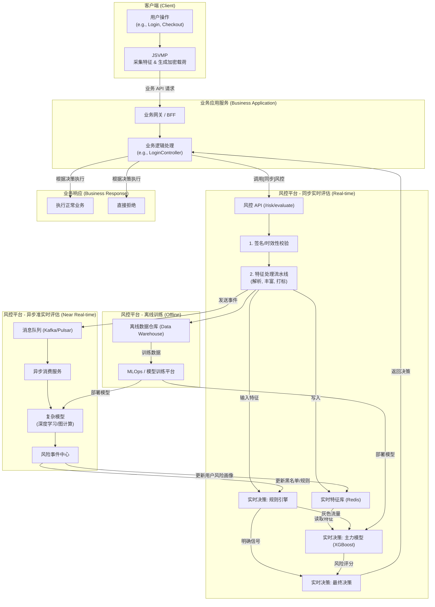

# Twisted - JavaScript 虚拟化保护套件

Twisted 是一套专为反爬虫和代码保护设计的 JavaScript 虚拟化解决方案。它通过将 JavaScript 代码编译为自定义的字节码，并在一个轻量级的 JavaScript 虚拟机 (VM) 中执行，来隐藏原始代码逻辑、增加逆向工程的难度。

## 🎯 项目概述

Twisted 套件包含三个核心模块，它们可以独立工作，也可以协同使用：

1.  **`obfuscator` (混淆器)**: 一个独立的 JS 代码混淆工具，用于在编译前对 AST（抽象语法树）进行转换，增加代码的复杂性。
    -   **输入**: JavaScript 代码文件
    -   **输出**: 经过混淆的 JavaScript 代码文件

2.  **`compiler` (编译器)**: 将 JavaScript 代码（无论是原始的还是混淆过的）编译为自定义的字节码。
    -   **输入**: JavaScript 代码
    -   **输出**: 字节码序列

3.  **`jsvmp` (虚拟机)**: 一个用 JavaScript 实现的轻量级栈式虚拟机，负责解释和执行由 `compiler` 生成的字节码。
    -   **输入**: 字节码序列
    -   **输出**: 代码执行结果

## 🏗️ 项目结构

```
twisted/
├── obfuscator/       # JavaScript 代码混淆器
├── compiler/         # JS-to-Bytecode 编译器
└── jsvmp/            # JavaScript 虚拟机 (VM)
```

## 🚀 快速开始

### 环境要求
- Node.js >= 16
- npm

### 安装依赖

为每个模块独立安装依赖：
```bash
# 安装混淆器依赖
cd obfuscator
npm install

# 安装编译器依赖
cd ../compiler
npm install

# 安装虚拟机依赖
cd ../jsvmp
npm install
```

## 📖 使用指南

### 1. (可选) 混淆 JavaScript 代码
使用 `obfuscator` 来增加代码的分析难度。
```bash
cd obfuscator
node src/index.js files/test.js
# 这将生成一个 files/test.ollvm.js 文件
```

### 2. 编译 JavaScript 为字节码
使用 `compiler` 将 JS 文件（可以是原始的或混淆过的）转换为字节码。
```bash
cd compiler
# 编译原始文件
node src/index.js files/test.js

# 或者编译混淆后的文件
node src/index.js ../obfuscator/files/test.ollvm.js
```
编译器会输出字节码并写入 `.bin` 文件。

### 3. 在 VM 中执行字节码
将生成的字节码复制到 `jsvmp` 中进行测试和执行。
```bash
cd jsvmp
# (手动将字节码数组粘贴到 src/index.js 中)
node src/index.js
```

## 🔧 核心功能

### `jsvmp` (虚拟机)
- ✅ **栈式虚拟机**: 基于栈的计算模型。
- ✅ **PC 管理**: 使用程序计数器跟踪执行。
- ✅ **变量存储**: 支持局部和全局变量存储。
- ✅ **指令集**: 包含算术、控制流、变量和栈操作。

### `compiler` (编译器)
- ✅ **AST 驱动**: 使用 Babel 解析 JS 为 AST。
- ✅ **Visitor 模式**: 通过遍历 AST 节点生成字节码。
- ✅ **基础语法支持**: 目前支持数字字面量和二元表达式。
- 🚧 **正在开发**: 变量声明、赋值、函数调用等。

### `obfuscator` (混淆器)
- ✅ **插件化架构**: 通过不同的 `Transformer` 实现混淆。
- ✅ **字符串混淆**: 加密字符串常量。
- ✅ **控制流平坦化 (FLA)**: 打乱原始的控制流。

## 📊 字节码格式说明

`jsvmp` 使用单字节操作码（Opcode），后面可以跟零个或多个操作数（Operand）。

### `jsvmp` 当前支持的指令集

| Opcode | 指令 | 操作数 | 描述 |
|:---:|:---|:---:|:---|
| `0x00` | Push | `value` | 将一个值压入栈顶 |
| `0x01` | Pop | - | 弹出栈顶的值 |
| `0x02` | Add | - | 弹出两个值，相加后压入结果 |
| `0x03` | Sub | - | 弹出两个值，相减后压入结果 |
| `0x04` | Mul | - | 弹出两个值，相乘后压入结果 |
| `0x05` | Div | - | 弹出两个值，相除后压入结果 |
| `0x06` | Jmp | `target` | 无条件跳转到目标地址 |
| `0x07` | JmpIf | `target` | 弹出栈顶值，如果为真则跳转 |
| `0x08` | LocalStore | `index` | 弹出栈顶值，存入局部变量 |
| `0x09` | LocalLoad | `index` | 加载局部变量的值并压入栈 |
| `0x0A` | GlobalStore | `index` | 弹出栈顶值，存入全局变量 |
| `0x0B` | GlobalLoad | `index` | 加载全局变量的值并压入栈 |

## 系统架构 (System Architecture)



## 🛡️ 混淆与保护策略 (Obfuscation & Protection Strategy)

Twisted 采用分层、分阶段的混淆策略，以实现最高强度的代码保护。混淆主要在两个不同层级上进行：AST (抽象语法树) 层面和 IR (中间表示) 层面。

### 1. AST 层面的混淆 (高层级，面向语法)

此阶段在 `obfuscator` 模块中进行，或者在 `compiler` 将代码转换为IR之前。它利用 Babel 提供的丰富的语法和作用域信息，对代码进行等价但更复杂的变换。

-   **主要任务**:
    -   **变量/函数名混淆**: 安全地重命名变量，使其失去语义。
    -   **字符串加密**: 将字符串常量替换为解密函数调用。
    -   **常量替换**: 将常量表达式在编译期预先计算。
    -   **死代码注入**: 添加无用的、迷惑性的代码分支。

### 2. IR 层面的混淆 (低层级，面向执行流)

此阶段在 `compiler` 模块内部，在生成IR之后、序列化为字节码之前进行。它不再关心JavaScript语法，而是直接操作虚拟机的指令序列，从根本上破坏代码的原始逻辑结构。

-   **主要任务**:
    -   **控制流平坦化 (Control Flow Flattening)**: 将 `if/else`, `for`, `while` 等结构拆散，通过一个中央分发器 (Dispatcher) 来调度，使执行流变得不可预测。
    -   **不透明谓词 (Opaque Predicates)**: 插入结果恒定的复杂条件判断，创造虚假的代码路径。
    -   **指令替换 (Instruction Substitution)**: 将简单的指令（如 `ADD`）替换为一组功能等价但更复杂的指令序列。

### 3. VM 运行时的自我保护

保护链的最后一环，也是最关键的一环，是对 VM 本身进行保护。在最终打包发布时，`jsvmp` 的 JavaScript 源代码也会经过一次彻底的传统JS混淆，防止攻击者通过分析VM来逆向字节码。这形成了一个完整的保护闭环。

## 🛡️ 开发路线图

### 短期目标
- [ ] **架构重构 (Architectural Refactoring)**:
    - [ ] 引入中间表示 (IR)，解耦AST分析与字节码生成，为控制流和优化打下基础。
- [ ] **完善编译器 (Compiler Enhancement)**:
    - [ ] 完善对通用成员表达式和函数调用的支持 (例如 `console.log(a)`)。
    - [ ] 基于IR实现 `IfStatement` 和循环 (`while`, `for`)。
    - [ ] 支持完整的变量声明和作用域。
- [ ] **增强 VM (VM Enhancement)**:
    - [ ] 添加字符串和对象数据类型支持。
    - [ ] 实现函数调用栈 (Call Stack)。
    - [ ] 添加完整的比较和逻辑操作指令。

### 长期目标
- [ ] **高级混淆 (Advanced Obfuscation)**: 
    - [ ] 在AST/IR层面实现可插拔的混淆Pass (例如，控制流平坦化)。
    - [ ] 实现虚拟机嵌套和指令乱序。
- [ ] **安全加固 (Security Hardening)**:
    - [ ] 对VM运行时本身进行混淆保护，防止被直接分析。
    - [ ] 在 VM 中加入反调试机制。
- [ ] **性能优化**: 识别热点路径并进行优化（如超级指令）。
- [ ] **工具链**: 开发字节码调试器和源码映射工具。

## 🤝 贡献

欢迎提交 Issue 和 Pull Request！

## 📄 许可证

ISC License