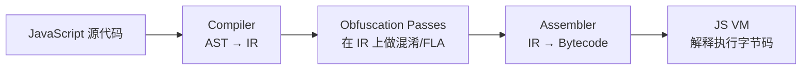
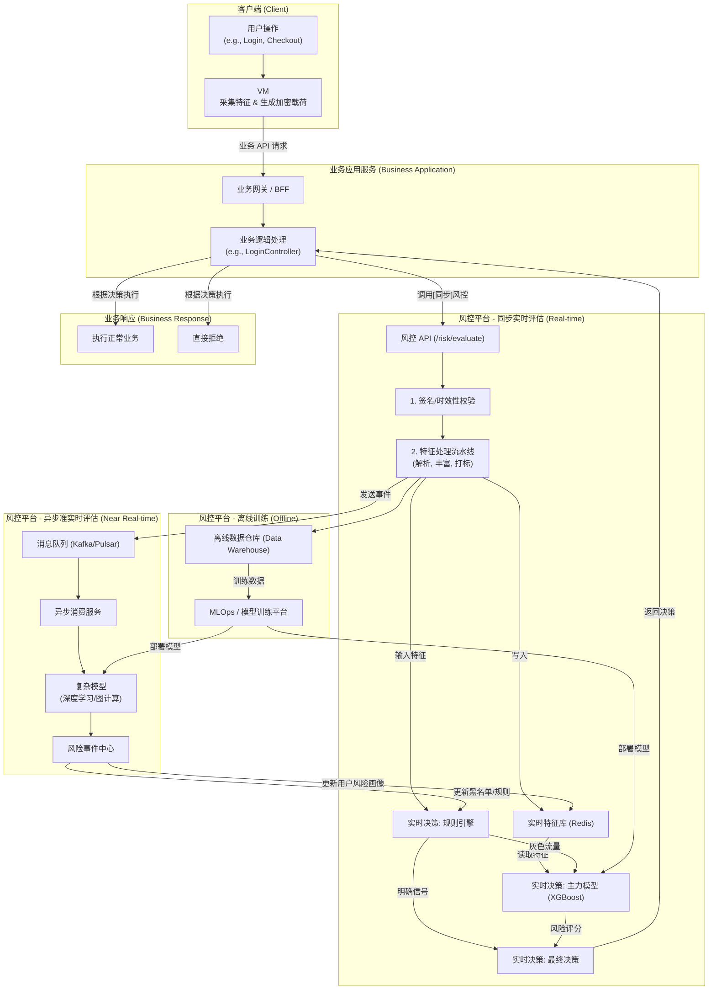

# Twisted - JavaScript 虚拟化保护套件

Twisted 是一套专为反爬虫和代码保护设计的 JavaScript 虚拟化解决方案。它通过将 JavaScript 代码编译为自定义的字节码，并在一个轻量级的 JavaScript 虚拟机 (VM) 中执行，来隐藏原始代码逻辑、增加逆向工程的难度。

## 🎯 项目概述

Twisted 套件包含三个核心模块，它们可以独立工作，也可以协同使用：

1.  **`obfuscator` (混淆器)**: 一个独立的 JS 代码混淆工具，用于在编译前对 AST（抽象语法树）进行转换，增加代码的复杂性。
    -   **输入**: JavaScript 代码文件
    -   **输出**: 经过混淆的 JavaScript 代码文件

2.  **`compiler` (编译器)**: 将 JavaScript 代码（无论是原始的还是混淆过的）先编译为中间表示 IR，再转换为自定义的字节码。
    -   **输入**: JavaScript 代码
    -   **输出**: Dict IR（中间表示）与字节码序列（通过 Assembler 从 IR 生成）

3.  **`vm` (虚拟机)**: 一个用 JavaScript 实现的轻量级栈式虚拟机，负责解释和执行由 `compiler` 生成的字节码。
    -   **输入**: 字节码序列
    -   **输出**: 代码执行结果

## 🏗️ 项目结构（当前代码架构）

当前仓库已经收敛为**单一 npm 包 + TypeScript 实现**，核心代码集中在 `src/` 目录：

```text
twisted/
├── src/
│   ├── constant.ts           # Opcode / Header 等常量定义
│   ├── index.ts              # 示例入口，当前用于演示编译器输出 IR
│   ├── compiler/
│   │   ├── compiler.ts       # JS 源码 → 线性 Instruction[] IR 的编译器
│   │   └── instruction.ts    # IR 结构定义与 createInstruction 工厂函数
│   ├── assembler/
│   │   └── assembler.ts      # 预留：IR → Bytecode 的汇编器（尚未实现）
│   ├── vm/
│   │   └── vm.ts             # TypeScript 实现的栈式虚拟机，解释执行字节码
│   ├── obfuscator/
│   │   ├── base.js           # AST 混淆器基础类（基于 Babel）
│   │   └── passes/
│   │       └── base.js       # 预留：混淆 Pass 基类
│   └── utils/
│       ├── bytecode.js       # 十六进制 / 十进制与字节码数组互转工具
│       └── file.js           # 文件读写工具
├── files/
│   └── test.js               # 示例 JS 源码，用于编译/调试
└── docs/
    ├── ir.md                 # Dict IR 规范文档（opcode + args[{type,value}] + Block）
    └── workflow.md           # 部署与混淆工作流设计
```

从设计上看，整体编译/执行流水线仍然是：



目前代码已经完整实现了 **Compiler（源码 → IR）** 与 **VM（执行字节码）**，`Assembler` 与完整的“IR → Bytecode → VM 串联 Demo”仍在开发中。

## 🚀 快速开始（基于当前仓库）

### 环境要求
- Node.js >= 16
- npm

### 安装依赖

在仓库根目录一次性安装依赖：

```bash
cd twisted
npm install
```

## 📖 使用指南

### 1. 运行示例编译（源码 → IR）

当前 `src/index.ts` 中内置了一段示例代码，会调用 `Compiler` 并打印 IR：

```bash
npm run start
```

你会在控制台看到形如 `Instruction[]` 的中间表示输出，方便调试指令序列与作用域处理。

### 2.（规划中）IR → Bytecode → VM 执行

下一步工作是补齐 `assembler/assembler.ts`，将 `Instruction[]` 编码为实际的字节码数组，并编写一个 Demo 将：

- `Compiler` 生成的 IR；
- `Assembler` 生成的字节码；
- `VM` 的解释执行逻辑  

串成一个完整的“源码 → IR → Bytecode → VM 执行”示例。实现完成后，本节会补充具体命令与使用示例。

## 🔧 核心功能

### `vm` (虚拟机)
- ✅ **栈式虚拟机**: 基于栈的计算模型。
- ✅ **PC 管理**: 使用程序计数器跟踪执行。
- ✅ **变量存储**: 支持局部和全局变量存储。
- ✅ **指令集**: 包含算术、控制流、变量和栈操作。

### `compiler` (编译器)
- ✅ **AST 驱动**: 使用 Babel 解析 JS 为 AST。
- ✅ **Visitor 模式**: 通过遍历 AST 节点生成 Dict IR（见 `docs/ir.md` 中的 Dict IR 规范）。
- ✅ **基础语法支持**: 目前支持数字字面量和二元表达式，并映射为 IR 指令序列。
- 🚧 **正在开发**: 变量声明、赋值、函数调用等。

### `obfuscator` (混淆器)
- ✅ **插件化架构**: 通过不同的 `Transformer` 实现混淆。
- ✅ **字符串混淆**: 加密字符串常量。
- ✅ **控制流平坦化 (FLA)**: 打乱原始的控制流。

## 📊 字节码格式说明

虚拟机使用单字节操作码（Opcode），后面可以跟零个或多个操作数（Operand）。

### 虚拟机当前支持的指令集

| Opcode | 指令 | 操作数 | 描述 |
|:---:|:---|:---:|:---|
| `0x00` | Push | `value` | 将一个值压入栈顶 |
| `0x01` | Pop | - | 弹出栈顶的值 |
| `0x02` | Add | - | 弹出两个值，相加后压入结果 |
| `0x03` | Sub | - | 弹出两个值，相减后压入结果 |
| `0x04` | Mul | - | 弹出两个值，相乘后压入结果 |
| `0x05` | Div | - | 弹出两个值，相除后压入结果 |
| `0x06` | Jmp | `target` | 无条件跳转到目标地址 |
| `0x07` | JmpIf | `target` | 弹出栈顶值，如果为真则跳转 |
| `0x08` | LocalStore | `index` | 弹出栈顶值，存入局部变量 |
| `0x09` | LocalLoad | `index` | 加载局部变量的值并压入栈 |
| `0x0A` | GlobalStore | `index` | 弹出栈顶值，存入全局变量 |
| `0x0B` | GlobalLoad | `index` | 加载全局变量的值并压入栈 |

## 系统架构 (System Architecture)



## 🛡️ 混淆与保护策略 (Obfuscation & Protection Strategy)

Twisted 采用分层、分阶段的混淆策略，以实现最高强度的代码保护。混淆主要在两个不同层级上进行：AST (抽象语法树) 层面和 IR (中间表示) 层面。

### 1. AST 层面的混淆 (高层级，面向语法)

此阶段在 `obfuscator` 模块中进行，或者在 `compiler` 将代码转换为IR之前。它利用 Babel 提供的丰富的语法和作用域信息，对代码进行等价但更复杂的变换。

-   **主要任务**:
    -   **变量/函数名混淆**: 安全地重命名变量，使其失去语义。
    -   **字符串加密**: 将字符串常量替换为解密函数调用。
    -   **常量替换**: 将常量表达式在编译期预先计算。
    -   **死代码注入**: 添加无用的、迷惑性的代码分支。

### 2. IR 层面的混淆 (低层级，面向执行流)

此阶段在 `compiler` 模块内部，在生成IR之后、序列化为字节码之前进行。它不再关心JavaScript语法，而是直接操作虚拟机的指令序列，从根本上破坏代码的原始逻辑结构。

-   **主要任务**:
    -   **控制流平坦化 (Control Flow Flattening)**: 将 `if/else`, `for`, `while` 等结构拆散，通过一个中央分发器 (Dispatcher) 来调度，使执行流变得不可预测。
    -   **不透明谓词 (Opaque Predicates)**: 插入结果恒定的复杂条件判断，创造虚假的代码路径。
    -   **指令替换 (Instruction Substitution)**: 将简单的指令（如 `ADD`）替换为一组功能等价但更复杂的指令序列。

### 3. VM 运行时的自我保护

保护链的最后一环，也是最关键的一环，是对 VM 本身进行保护。在最终打包发布时，VM 的 JavaScript 源代码也会经过一次彻底的传统 JS 混淆，防止攻击者通过分析 VM 来逆向字节码。这形成了一个完整的保护闭环。

## 🛡️ 开发路线图

### 短期目标
- [ ] **架构重构 (Architectural Refactoring)**:
    - [ ] 引入中间表示 (IR)，解耦AST分析与字节码生成，为控制流和优化打下基础。
- [ ] **完善编译器 (Compiler Enhancement)**:
    - [ ] 完善对通用成员表达式和函数调用的支持 (例如 `console.log(a)`)。
    - [ ] 基于IR实现 `IfStatement` 和循环 (`while`, `for`)。
    - [ ] 支持完整的变量声明和作用域。
- [ ] **增强 VM (VM Enhancement)**:
    - [ ] 添加字符串和对象数据类型支持。
    - [ ] 实现函数调用栈 (Call Stack)。
    - [ ] 添加完整的比较和逻辑操作指令。

### 长期目标
- [ ] **高级混淆 (Advanced Obfuscation)**: 
    - [ ] 在AST/IR层面实现可插拔的混淆Pass (例如，控制流平坦化)。
    - [ ] 实现虚拟机嵌套和指令乱序。
- [ ] **安全加固 (Security Hardening)**:
    - [ ] 对VM运行时本身进行混淆保护，防止被直接分析。
    - [ ] 在 VM 中加入反调试机制。
- [ ] **性能优化**: 识别热点路径并进行优化（如超级指令）。
- [ ] **工具链**: 开发字节码调试器和源码映射工具。

## 🤝 贡献

欢迎提交 Issue 和 Pull Request！

## 📄 许可证

ISC License