## 部署与混淆工作流（初始方案）

为了先把整体链路跑通，我们采用一条**相对简单、易实现**的 jsvmp 工作流：  
先完成「源码 → 字节码 → VM 执行」这条主线，再在最外层对 `VM + bytecode` 做统一混淆。

---

## 阶段一：业务逻辑 JS → AST → 字节码

- **目标**：把清晰的业务 JS 逻辑编译成可由自定义 VM 执行的字节码（bytecode）。
- **输入**：业务源码 JS 文件（例如 `signature.js`）。
- **过程**：
  1. **解析阶段（Parse）**
     - 使用 Babel 等工具将 JS 源码解析为 AST。
  2. **语义遍历（AST Traverse）**
     - 按照项目的编译规则，识别变量声明、表达式、控制流结构（`if/for/while` 等）。
  3. **指令生成（Codegen → Bytecode）**
     - 将 AST 节点映射为自定义的 VM 指令序列：
       - 例如：`BinaryExpression(+)` → `PUSH` / `ADD` 等 opcode。
       - 控制流结构转换为跳转指令、标签等。
- **输出**：一份未混淆或轻度混淆的字节码文件，例如：`signature.bytecode`。

> 在这个初始方案中，**AST → bytecode 阶段只做最小必要的处理**，以保证编译器简单、可调试。后续可以在这一阶段逐步加入更复杂的“指令级混淆”能力。

---

## 阶段二：VM + 字节码 → 统一混淆 → 前端执行

- **目标**：将 VM 解释器代码和业务字节码打包在一起，通过一次统一的 JS 混淆，使前端实际拿到的是一份「整体加壳」的脚本。
- **输入**：
  - VM 解释器源码（例如 `jsvmp/src/vm/vm.js`）。
  - 阶段一输出的字节码文件（例如 `signature.bytecode`）。
- **过程**：
  1. **打包（Bundle）**
     - 编写一个打包脚本，将：
       - VM 解释器代码；
       - 字节码加载逻辑（读 `signature.bytecode` 或内嵌二进制数组）；
       - 对外暴露的调用接口（例如 `genSignature(params)`）  
       组合成一份独立的 JS 文件（例如 `runtime.vm.bundle.js`）。
  2. **整体混淆（Obfuscation）**
     - 使用通用 JS 混淆器（如 `javascript-obfuscator`）对 `runtime.vm.bundle.js` 进行强混淆：
       - 控制流平坦化（Control Flow Flattening）。
       - 字符串加密 / 常量折叠。
       - 变量名/函数名混淆。
       - 死代码注入（可选）。
  3. **部署**
     - 将混淆后的脚本（例如 `runtime.vm.bundle.obf.js`）作为前端资源部署到 CDN / 静态服务器。
- **输出**：一份已经加壳的 VM+字节码整体脚本（例如 `runtime.vm.bundle.obf.js`），前端只需要以普通 `<script>` 的方式加载。

---

## 整体流程图（初始版本）

```mermaid
graph TD
    subgraph "编译阶段 (Build Time)"
        A["业务逻辑 JS (signature.js)"] --> B["Parser (JS -> AST)"];
        B --> C["Compiler (AST -> Bytecode)"];
        C --> D["字节码文件 (signature.bytecode)"];

        E["VM 解释器源码 (vm.js)"] --> F["打包器 (Bundle VM + Bytecode)"];
        D --> F;
        F --> G["VM + Bytecode 一体化脚本 (runtime.vm.bundle.js)"];
        G --> H["JS 混淆器 (javascript-obfuscator 等)"];
        H --> I["混淆后的脚本 (runtime.vm.bundle.obf.js)"];
    end

    subgraph "运行阶段 (Browser Runtime)"
        J["浏览器加载页面"] --> K["加载 runtime.vm.bundle.obf.js"];
        K --> L["还原 VM + Bytecode 逻辑"];
        L --> M["VM 解释执行字节码"];
        M --> N["产出签名 / 业务参数"];
    end
```

---

## 小结与后续演进方向

- 当前方案的核心链路是：
  - **`JS → AST → Bytecode`**：先把业务逻辑迁移到虚拟机体系；
  - **`VM + Bytecode → 打包 + 混淆 → 前端执行`**：用一次性壳保护整体实现。
- 这样可以快速构建一个可运行、可调试的 jsvmp 流程，方便验证指令集设计与 VM 行为。
- 后续可以在不改变大框架的前提下，逐步增强：
  - 在 AST→bytecode 阶段加入指令级混淆（控制流扁平化、垃圾指令、不透明谓词等）。
  - 将「整体混淆」升级为「加密 + 分段加载 + 动态校验」等更高强度方案。

