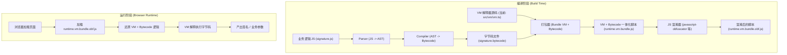

## 部署与混淆工作流（初始方案）

为了先把整体链路跑通，本项目设计了一条**相对简单、易实现**的 Twisted / JSVMP 工作流：  
目标主线是「源码 → AST → IR → 字节码 → VM 执行」，再在最外层对 `VM + bytecode` 做统一混淆。

---

## 阶段一：业务逻辑 JS → AST → IR → 字节码

- **目标**：把清晰的业务 JS 逻辑编译成中间表示 IR，再编码为可由自定义 VM 执行的字节码（bytecode）。
- **输入**：业务源码 JS 文件（例如 `signature.js`）。
- **过程**：
  1. **解析阶段（Parse）**
     - 使用 Babel 等工具将 JS 源码解析为 AST。
  2. **语义遍历（AST Traverse）**
     - 按照项目的编译规则，识别变量声明、表达式、控制流结构（`if/for/while` 等）。
  3. **IR 生成（Codegen → IR）**
     - **设计上**：将 AST 节点映射为 Dict IR（见 `docs/ir.md`），形成由 Block / Instruction / Arg 组成的中间表示；
     - **当前实现中**：编译器只生成一维的 `Instruction[]` 线性 IR（见 `src/compiler/instruction.ts`），尚未引入 Block 级 Dict IR。
  4. **汇编（Assembler：IR → Bytecode）**
     - **设计上**：由 Assembler 将 IR 中的 opcode / args 编码为线性字节码数组，处理 Header、字符串池、DYN_ADDR 回填等底层细节；
     - **当前实现中**：`src/assembler/assembler.ts` 仍为空文件，字节码编码逻辑尚未落地。
- **输出**：
  - 一份结构化 IR（便于调试与混淆）；
  - 一份未混淆或轻度混淆的字节码文件，例如：`signature.bytecode`。

> 在这个初始方案中，**AST → bytecode 阶段的设计尽量保持简单可调试**。当前仓库只实现到了 “AST → 线性 IR（Instruction[]）”，后续会在：
> - 增加 Dict IR（Block 字典）；
> - 实现 Assembler（IR → Bytecode）；
> - 在 IR 层加入控制流平坦化、垃圾指令、不透明谓词等“指令级混淆”能力。

---

## 阶段二：VM + 字节码 → 统一混淆 → 前端执行

- **目标**：将 VM 解释器代码和业务字节码打包在一起，通过一次统一的 JS 混淆，使前端实际拿到的是一份「整体加壳」的脚本。
- **输入**：
  - VM 解释器源码（当前仓库中的 `src/vm/vm.ts`，未来也可以替换为独立 Rust VM 实现）；
  - 阶段一输出的字节码文件（例如 `signature.bytecode`）。
- **过程**：
  1. **打包（Bundle）**
     - 编写一个打包脚本，将：
       - VM 解释器代码；
       - 字节码加载逻辑（读 `signature.bytecode` 或内嵌二进制数组）；
       - 对外暴露的调用接口（例如 `genSignature(params)`）  
       组合成一份独立的 JS 文件（例如 `runtime.vm.bundle.js`）。
  2. **整体混淆（Obfuscation）**
     - 使用通用 JS 混淆器（如 `javascript-obfuscator`）对 `runtime.vm.bundle.js` 进行强混淆：
       - 控制流平坦化（Control Flow Flattening）。
       - 字符串加密 / 常量折叠。
       - 变量名/函数名混淆。
       - 死代码注入（可选）。
  3. **部署**
     - 将混淆后的脚本（例如 `runtime.vm.bundle.obf.js`）作为前端资源部署到 CDN / 静态服务器。
- **输出**：一份已经加壳的 VM+字节码整体脚本（例如 `runtime.vm.bundle.obf.js`），前端只需要以普通 `<script>` 的方式加载。

---

## 整体流程图（初始版本）

---

## 小结与当前实现进度

- **当前仓库已经落地的部分**：
  - TypeScript 编译器（`src/compiler/compiler.ts`）：`JS → AST → 线性 IR (Instruction[])`；
  - TypeScript 栈式 VM（`src/vm/vm.ts`）：根据 `src/constant.ts` 中的 `OPCODE` 执行字节码数组；
  - IR / 工作流文档（本文件以及 `docs/ir.md`），用于约束后续设计。
- **尚未在本仓库实现的部分**：
  - Dict IR（Block 字典）及其在编译器中的完整生成逻辑；
  - Assembler（`src/assembler/assembler.ts`）：IR → 字节码 编码、Header / 字符串池 / DYN_ADDR 回填；
  - 真正的字节码文件产物（`.bytecode` / `.bin`）以及自动打包脚本；
  - Rust VM（目前仅作为目标架构存在于文档中，本仓库不包含 Rust 代码）。

整体框架可以理解为：  
当前代码提供了一个可运行、可调试的 **“编译器 + TS VM” 原型**，文档里的 Dict IR、Assembler、Rust VM 等内容是下一步演进方向，在实现时请以本文档为设计蓝本，对照落地。

